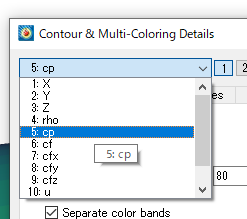

# spanwiseLiftPlotterForTecplot

Tecplot Surface CL Distribution Tool

This tool automates the process of extracting surface CL distribution from Tecplot datasets and plotting the results. It allows users to calculate and visualize the lift coefficient (`Cl`) distribution across a propeller blade span.

## Features

- Automated extraction of surface data slices from Tecplot datasets.
- Calculation of the area under the curve, representing the lift coefficient.
- Visualization of the `Cl` distribution as a function of `r/R`.
- Output of the `Cl` values to a text file for further analysis.

## Requirements

- Python 3.x
- Tecplot 360 with Python API (`tecplot` package)
- NumPy
- Matplotlib

## Installation

1. Install the required Python packages:
    ```bash
    pip install pytecplot numpy matplotlib
    ```

2. Ensure that Tecplot 360 is installed and accessible from your Python environment.

## ⚠️IMPORTANT⚠️ Setup for you own plt data

For the script to function correctly, the spanwise direction must be set to the x-axis and the chordwise direction to the z-axis in Tecplot. If you need to change the spanwise axis, modify line 48 in the script:

```python
tp.active_frame().plot().slice(0).origin.x = span
```

Change `x` to `y` or another axis as required.

Additionally, ensure that the coordinate for the spanwise direction and the `cp` variable's index are correctly set. To verify the variable indices, refer to the "Contour & Multi-Coloring Details" dropdown in Tecplot, as shown in the image. 



For example, in the attached image, if you want to write the data for `Y` and `cp`, set the `variables` parameter on line 54 to:

```python
variables=[1, 4],
```

This ensures that the correct variables are extracted and saved in the output file.

Please make these changes to your script according to your specific data setup to ensure proper functionality.
## Usage

1. Clone this repository to your local machine:
    ```bash
    git clone https://github.com/HiroWW/spanwiseLiftPlotterForTecplot.git
    cd spanwiseLiftPlotterForTecplot
    ```

2. Modify the paths in the script to match your local environment:
    - Replace `C:\\Users\\{user}\\hogehoge\\` with the appropriate directory path.

3. Run the script:
    ```bash
    python main.py
    ```

4. The script will output the `Cl` distribution plot and save the results in a `cl-r_R.txt` file.

## Contributing

Feel free to submit issues or pull requests if you encounter any bugs or have suggestions for improvements.

## License

This project is licensed under the MIT License - see the [LICENSE](LICENSE) file for details.
